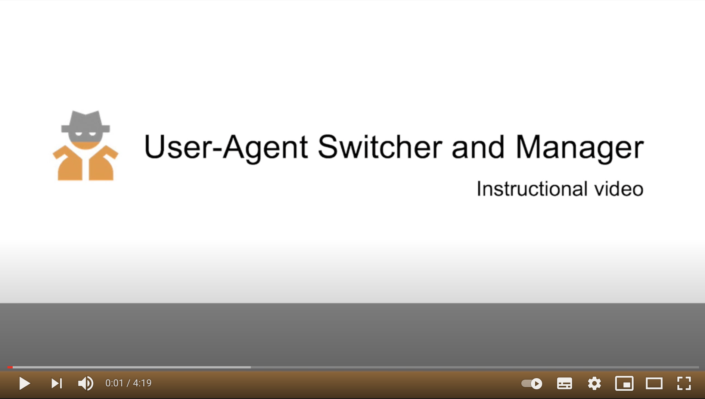

# Anonymity and Spoofing Technologies

## Undercover agent anonymity
---

Anonymity is one of the main concerns when online investigations for consumer protection is conducted (a.k.a **consumer forensics**).  Naturally, when doing mystery shopping for law enforcement the undercover agent will make sure that a shop in question does not know her identity in order to experience the usual treat of an average consumer.

In the online marketplaces there is no difference, the **law enforcement aim to keep the undercover status** also online. However, the investigations would be normally conducted from the actual computers of the consumer authorities offices, potentially giving away the identity by inferring information like location or IP adresses. Moreover, this information is public, the internet is in principle a transparent public space, anyone can check their open data at [deviceinfo.me](https://www.deviceinfo.me/). 

Nevertheless, **all this information can be spoofed**, since, technically speaking “all hardware is software”. A great example are virtual machines. **Virtual machines** are software applications that emulate a complete operating system inside another one, e.g. having a Windows machine “inside” a Mac. If a user visits Facebook from the Windows machine, **Facebook has absolutely no way to know that it is visited by a virtual machine**.

In conclusion, a user can spoof her location, country, type of device (mobile or desktop), internet browser, internet provider, default language, operative system, IP address, etc. Furthermore, there are different technologies that can do it fairly easily, but in order to comprehend how reliable they are and to make sure that someone can keep the undercover agent status, it is necessary to understand how webdrivers, user-agents and proxy technologies work.

**All the tools created for this project ([Facebook Ads API](https://pedrohserrano.github.io/legaltech-consumer-protection/Facebook_Ads_API.html), [PersonaBot for Facebook Ads](https://pedrohserrano.github.io/legaltech-consumer-protection/Facebook_PersonaBot/), [PersonaBot for Google Ads](https://pedrohserrano.github.io/legaltech-consumer-protection/PersonaBot/), [Dutch Products Crawler](https://pedrohserrano.github.io/legaltech-consumer-protection/Dutch_Products_Prices_Analysis.html) ) user-agents and proxy technologies**

---
## About Spoofing Technologies
---

Developers and users manually interact with browser applications for different reasons. **Every web user has a user-agent** – a software that enables user interaction with web content by acting as a mediator between users and web servers (the hardware underlying webpages). The user-agent processes and transmits users’ instructions to the web server and then delivers the appropriate data back to the user. Many applications act as user-agents, including browsers like Chrome, Safari, or Mozilla Firefox . Once a user-agent identifies itself to the server, it is common for applications to receive content tailored to the user-agent, a process called agent name delivery. **It is possible to change one’s user-agent through search engine development tools or browser extensions.** 
Furthermore, the whole process of web interaction can also be automated and configured, meaning certain methods can be deployed to emulate real-life users or other devices. **The main architecture underlying all types of automation are WebDrivers.** WebDrivers are automation frameworks that were originally created to perform tests to be executed across browsers (the software used to access internet content). WebDrivers control the browser from the operating system level and ultimately the aim of WebDrivers is to emulate real user interactions with browsers as much as possible, the extent to which depends on the different browsers. 
Most recently WebDrivers were popularized by computer scientists and data scientists **by changing its original purpose of testing apps to the creation of Web Crawlers** for data extraction at scale from the web. Every single Web Crawler technology works by definition with WebDrivers.

Note that there are a number of different WebDrivers like CasperJS implemented on JavaScript or Puppeteer for NodeJS, although **Selenium is the most popular WebDriver architecture** as it allows cross browser compatibility testing, supports multiple operating systems (Windows, Mac, Linux, etc.), provides compatibility with a range of languages (Java, JavaScript, Python, etc.) and provides support for many browsers. The Python implementation for Selenium appears to be the default option for Computational Social Science research. 
 
Some of the uses are: Automation of apps, Automation of web browsing, Creation of web crawlers, User-agent configuration, Applications monitoring, Automatic content creation.

In concussion, WebDrivers scripts can emulate real users behavior by browsing the internet making it automatic, **these automated WebDriver scripts are usually called “Bots”.** 

---
## Spoofing Tools
---

### User-Agent Switcher and Manage  

‣ [Video Tutorial](https://youtu.be/ok3txwN0ywc)  
‣ [Browser Extension](https://chrome.google.com/webstore/detail/user-agent-switcher-and-m/bhchdcejhohfmigjafbampogmaanbfkg)  

User-Agent Switcher and Manager is an open source browser extension. This browser extension allows you spoof your browser "user-agent" string to a custom designation, making it impossible for websites to know specific details about your browsing arrangement, therefore you could browse the web with your Apple laptop and pretend you are in an Android phone. In the video tutorial you will explore the concept of user-agent and its role in the interaction between users and the web, for those who are conducting manual of web investigation, this is the ideal tool.  

### Spoof Timezone  

‣ [Video Tutorial](https://youtu.be/_IQt3X-oQc4)  
‣ [Browser Extension](https://chrome.google.com/webstore/detail/spoof-timezone/kcabmhnajflfolhelachlflngdbfhboe)  

Spoof Timezone is an open source browser extension. This browser extension allows you alter your browser timezone to a user-defined value. This extension spoofs the current timezone provided by JavaScript to web pages. You can specify the preferred timezone in the options page and make sure your real timezone is protected (invisible by websites), therefore you could browse the web from Maastricht and pretend you are in Amsterdam.  
