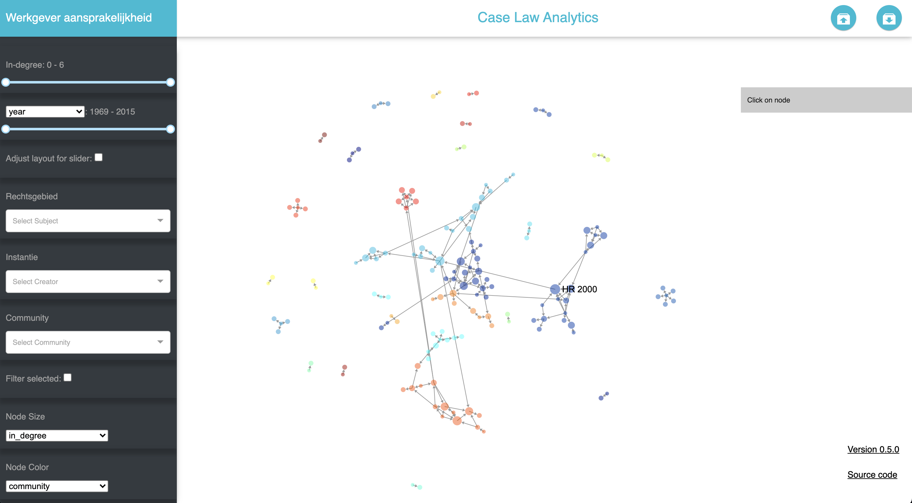
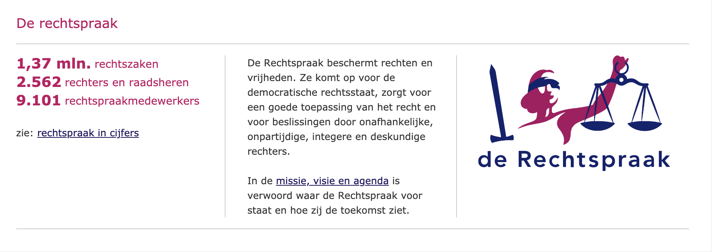
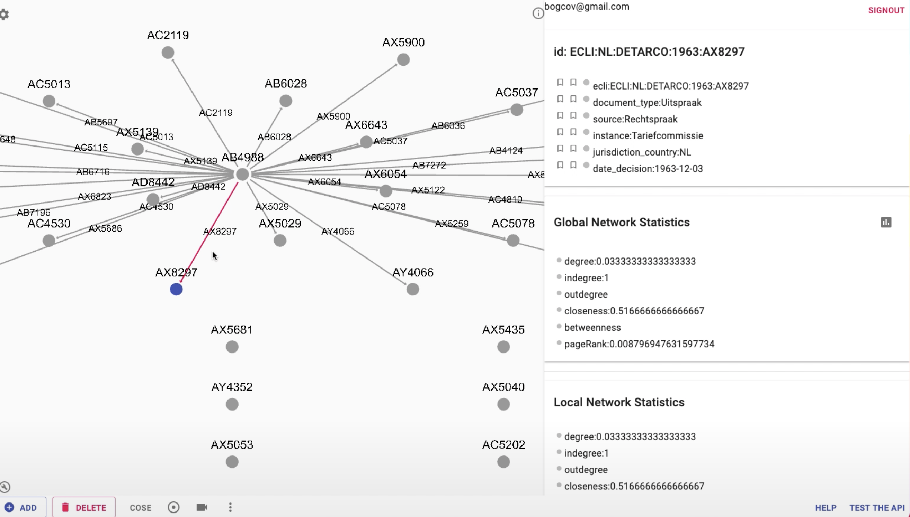

## Project 

Consumer Protection is a filed that
Legal Technologies come to aleviate this

The inspiration of the research is based on

- European Comission report
- NWO grant
- Working paper

Case Law Explorer is the result of a number of efforts, it was originated from its parent version [Case Law Analytics](https://nlesc.github.io/case-law-app/) on which objective was developing and using technology for searching, analyzing and visualizing court decisions. Allowing legal scholars to quickly analyze a large number of cases. This effort was accomplished together with the [Netherlands eScience Center and SURF](https://www.surf.nl/nieuwe-technologie-versterkt-juridisch-onderzoek). The pilot version is also Open Source and available in its original repostory [NLeSC/case-law-app](https://github.com/NLeSC/case-law-app).

More recently serves as the building blocks for the project [Web of Law](https://www.surf.nl/web-of-law-training-students-for-the-21st-century-using-web-based-network-analysis) that intends to train students for the 21st-century LegalTech skills using these tools and studying the concepts of Network Analysis.

------------------------
Currently, the data that is connected to the tool comes from [De Rechstpraak](https://www.rechtspraak.nl/) which is the main source of case law in the Netherlands 

Follow-ups of the project intend to extend the data sources of case law.

------------------------

The current tool is based on [Perfect Graph](https://sabaturgay.github.io/perfect-graph-docs/) framework for semantic and dynamic network visualization and analysis 

## Events

- 

## Researchers

- Caroline Cauffman
- Pedro V Hernandez Serrano

## Publications