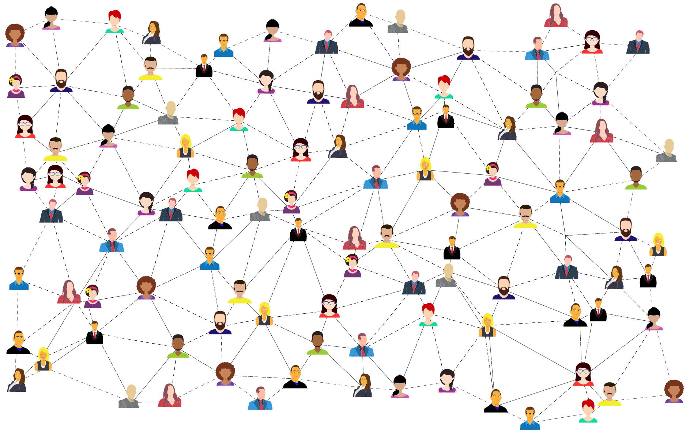

# LegalTech for Consumer Protection

Legal Technologies for Consumer Protection is a [Maastricht University](https://www.maastrichtuniversity.nl/) interdisciplinary research conducted by the Maastricht European Private Law Institute [(M-EPLI)](https://www.maastrichtuniversity.nl/M-EPLI), the Institute of Data Science [(IDS)](https://www.maastrichtuniversity.nl/research/institute-data-science), and the Authority for Consumer and Markets in the Netherlands [(ACM)](https://www.acm.nl/en). **This research explores the legal and technical means for developing innovative and transparent LegalTech software for consumer protection purposes.**

------

<!--  -->

---
### Background
---

The project builds upon work carried out for DJ Justice and Consumers **Exploring IT/AI tools for monitoring online markets for consumer policy purposes** JUST/2018/CONS/PR/CO01/0123 and a follow-up project collaborating with the Dutch authority for consumers and markets. This endeavour got granted an [NWO-IDG](https://www.nwo.nl/onderzoeksprogrammas/nationale-wetenschapsagenda/vernieuwing-en-netwerken/ideeengenerator-nwa-idg-0) award by the research idea of **Using AI for Consumer Protection: creating AI-based persona for mystery shopping**. The project aimed to develop and improve methods for monitoring e-commerce and online advertising given the detection of infringements of existing legal rules and further policy development in the fields of **consumer law, anti-discrimination law and privacy protection**, building on interdisciplinary law and technology research.

The 2019 Consumer protection regulation allows consumer authorities to conduct data analysis and online mystery shopping. For example, a consumer authority can determine how the online seller behaves by pretending to be a consumer. In particular, a consumer authority can investigate whether a consumer is shown different prices or adverts by comparing other traits (e.g. a "deal hunter", "negligent shopper", or "elderly female"). 

These selling practices are made possible by personalized algorithmic content using data analytics and computer engineering that often cross the line of the prohibition of unfair commercial practices and infringe the rights of consumers.

A new breed of legal technologies appears to be equipped to perform investigations on these issues. Not only consumer law enforcement bodies are primarily benefited by the development of these technologies but also scholars. The goal is to study challenging questions and implement prototypes both from a legal and technical perspective.

---
### Publications
---

‣ **Editorial: Discrimination in Online Advertising**  
Maastricht Journal of European and Comparative Law - Open Access  
Read the paper: [DOI: 10.1177/1023263X211022526](https://journals.sagepub.com/doi/full/10.1177/1023263X211022526)

‣ **A New Order: The Digital Services Act and Consumer Protection**  
European Journal of Risk Regulation - License CC BY 4.0  
Read the paper: [DOI: 10.1017/err.2021.8](https://www.researchgate.net/publication/350917767_A_New_Order_The_Digital_Services_Act_and_Consumer_Protection)  

‣ **An exploratory study of information technology (IT) and artificial intelligence (AI) tools for consumer protection in digital markets**  
Symposium Consumer and Data Privacy 2020: [Conference](https://www.maastrichtuniversity.nl/events/symposium-consumer-and-data-privacy-digital-revolution-legal-social-and-economic-interaction)  
Poster and Findings: [DOI: 10.13140/RG.2.2.10144.30724](https://www.researchgate.net/publication/348937412_An_exploratory_study_of_information_technology_IT_and_artificial_intelligence_AI_tools_for_consumer_protection_in_digital_markets_An_European_Commission_Tender)  
Read the report: [Public version](https://drive.google.com/file/d/1c628y57bWE9gPV27oFSPz8bU18kZ82-v/view?usp=sharing)

‣ **Researching algorithmic unintentional discrimination in online advertisement and e-commerce**  
Working paper: [Preprint](https://drive.google.com/file/d/1KbCoSF8WMNm96QwaRHSV_dIEf-Lb8m7_/view?usp=sharing)  
Presentation: [Slides](https://docs.google.com/presentation/d/e/2PACX-1vSf1i7VjWyRfFLa4Kyyc0LZjbuPnX2oZc1LZ3wI1cXr9B4FzTPqglC0drcGRhytPGfq7nGO6zVO4o6m/pub?start=false&loop=false&delayms=5000)  

---
### Software
---
By definition, online automated systems that use algorithmic personalization or recommendation techniques are trained on user internet browsing's data.
This internet browsing data comes from different sources (or a combination that usually is not disclosed by the tech industry). For example:

- Google Ads impressions are based mainly on users' browsing history or IP locations.
- Google Search results use hardware data (i.e. what OS are you using).
- Prices of products of some retail websites are based on the user-website interaction helped by cookies.   
- Social Media Ads are mainly based on the user's behaviour in that social media platform
- etc.

Therefore, as of 2021, no one-size-fits-all technique can be used to create AI-based Personas for online mystery shopping. However, it is possible to implement separate LegalTech software for investigations and compose user interfaces to unite them all.  

---

‣ **[Facebook Ads Auditor](https://pedrohserrano.github.io/legaltech-consumer-protection/Facebook_Ads_Auditing/)**  

This technology is a ready-to-use **Ads Analysis Auditing Tool** written in Python that uses the official **Facebook Graph API** to access the Facebook Ads library and gather Ads data at scale. The methodology and limitations of the code were tested. We performed a pilot data analysis on more than **2,000 Facebook Ads from the Netherlands** on the housing and credit topic as a use case.  

‣ **What can be used for?**  

- It can be used for investigations on particular Facebook Ads campaigns that are suspected to be scams, misinformation campaigns or ads that have discriminatory nature. The analysis gives insights over the targeted audience demographics, the money spent and who was the campaign creator.  

‣ **Limitations**  

- No GUI (graphical user interface)  
- The user needs to have a potential suspicious topic or campaign in mind  
- Facebook Ads API **only** allows accessing the `Social Issues, Elections or Politics` category.  

---

‣ **[Facebook Ads CrawlerBot](https://pedrohserrano.github.io/legaltech-consumer-protection/Facebook_Ads_CrawlerBot/)**  

This technology is an in-house build **Python script that simulates user-agent** browsing behaviour in the **Facebook news feed**. This script is based on the Selenium web-drivers family and aims to scrape and collect ads in the form of screenshots and raw HTML Ad source code. The methodology was tested by collecting ads based on different traits.    

‣ **What can be used for?**  

- It can be used to conduct investigations of discriminatory ads shown to certain demographic groups (e.g. middle-aged female gamer) given the over personalization of users news feeds in Facebook.  

‣ **Limitations**  

- No GUI (graphical user interface)    
- The user needs to have access to a Facebook accounts that can represent groups of interest at least once.

---

‣ **[Google Ads PersonaBot](https://pedrohserrano.github.io/legaltech-consumer-protection/PersonaBot/)**  

This technology is an in-house build **Python script that simulates user-agent** browsing behaviour in a set of predefined websites that are proxies of consumer traits. This script is based on the Selenium web-drivers family and aims to train user-agents representing consumer traits. The methodology was tested in a small set-up where screenshots were collected based on different traits.  

‣ **What can be used for?**  

- It can be used to conduct investigations of discriminatory Google ads shown to certain demographic groups (e.g. religious male elderly) on popular websites.  

‣ **Limitations**  

- No GUI (graphical user interface)    
- The user needs to define the desired websites to investigate, we used:   
`nu.nl, msn.com, buienradar.nl, bbc.com`  
- The tool considers around 20 Personas. If the user wants to add a new Persona, then it has to be manually added    
- Some predefined Persona groups might be not 100% accurate 

---

‣ **[Dutch Prices CrawlerBot](https://pedrohserrano.github.io/legaltech-consumer-protection/Dutch_Prices_CrawlerBot/)** 

This technology is an automated web scrapper, highly configurable and integrated with CD/CI Github deployments. This in-house build library is a Python-based Selenium web-driver that automatically visits popular Dutch retail websites and collects products information, including descriptions, prices and sellers. We tested the methodology by collecting data on more than **200 Dutch Products**    

‣ **What can be used for?**   

- It can be used to conduct investigations of **algorithmic pricing** and online commercial practices from different sellers in retail websites.  

‣ **Limitations**  

- No GUI (graphical user interface)    
- The tool only collects data and put it in tabular fomat. The analysis is not included.   
- The tool only works for the following websites:   
`ah.nl, bol.com, bonprix.com, coolblue.com, lidl.com, mediamark.nl`   
- Web scrappers technologies depend entirely on the HTML source code of the website. Therefore, when one of those websites changes, the tool won't work for the upgraded website.    
- The tool can be executed on the Github cloud or from a local device. If run locally, the IP address will be revealed. If the user wants to change the geolocation, it has to be manually done or combined with a VPN.  

---

‣ **[Repurposing BI tools](https://www.tableau.com/)** 

BI (business intelligence) technologies are licenced software for data analysis (e.g. Tableau, KNIME). These tools are popular since allowing big data manipulation using powerful visualizations without requiring coding skills. We tested it for consumer protection issues using the data extracted from the Dutch Prices CrawlerBot. The combination of both tools is an excellent example of how to enhance online consumer investigations.     

‣ **What can be used for?**   

- It can be used to conduct investigations of **algorithmic pricing** by comparing the trend of prices of selected products among different sellers in retail websites.  

‣ **Limitations**  

- It requires a paid license  
- The user must have ready to use clean data on consumer related issues.  

---

‣ **[Spoofing Extensions](https://pedrohserrano.github.io/legaltech-consumer-protection/spoofing/)**  

**Spoof Timezone** and **User-Agent Switcher and Manager** are external open-source tools that can be used to fake one's location and user-agent (device, browser, operating system). Although the tools come as browser extensions, we have tested them and created tutorials for investigation purposes.  

‣ **What can be used for?**   

- It can be used to conduct manual investigations of anything related to personalization in the web where the personalization algorithms specifically based their information on the user's hardware (e.g. mobile device) or the user's location (e.g. Maastricht).   

‣ **Limitations**  

- Only works for Google Chrome browser  
- These are browser extensions and do not collect data. In case the user wants to collect data, it has to be done manually.  

---
**Can these technologies be used in anonymity by consumer protection authorities to conduct investigations? Yes**   
More info on spoofing technologies section under the ["Undercover agent anonymity" section.](https://pedrohserrano.github.io/legaltech-consumer-protection/Spoofing/)

---
### Links
---

‣ **Webinar on Researching Discrimination in E-Commerce and Online Advertising:**  
4 and 5 March 2021: [Original event](https://www.maastrichtuniversity.nl/events/researching-discrimination-e-commerce-and-online-advertising-webinar)  
Webinar report: [Read the report](https://docs.google.com/document/d/e/2PACX-1vTmgfNMXLEvlQCYfF9jtB7Nc_a3n1qGQCNraPnkAweTsB6E8FDJXIn4fDtlrHOY3Q/pub)  

‣ **DSRI: Data Science Research Infrastucture**  
[Website](https://maastrichtu-ids.github.io/dsri-documentation/)  
All our software is build and tested at scale in the DSRI cluster for computer science research 

‣ **M-EPLI: Maastricht European Private Law Institue**  
[Website](https://www.maastrichtuniversity.nl/M-EPLI)  and [M-EPLI talks](https://www.maastrichtuniversity.nl/research/m-epli/m-epli-talks)   

‣ **Related Work**  

[AdAnalyst](https://chrome.google.com/webstore/detail/adanalyst/dichdbdjmcpgniopphedodbhkcdkoglm) is a browser extension aimed to collect information about Facebook Ads and investigates advertising practices at scale, this work is the result of a research project, [learn more here](https://adanalyst.mpi-sws.org).    

[OpenWPM](https://openwpm.readthedocs.io/en/latest/) is a web privacy measurement framework that makes it easy to collect data for privacy studies on a scale of thousands to millions of websites. OpenWPM is built on top of Firefox, with automation provided by Selenium. [learn more here](https://github.com/mozilla/OpenWPM).

---
### People
---
‣  [Pedro V Hernandez Serrano](https://www.maastrichtuniversity.nl/p.hernandezserrano) | **Data Scientist, Faculty of Science and Engineering**  
[p.hernandezserrano@maastrichtuniversity.nl](mailto:p.hernandezserrano@maastrichtuniversity.nl) 

‣  [Catalina Goanta](https://www.maastrichtuniversity.nl/nl/catalina.goanta) | **Assistant Professor in Private Law, Faculty of Law**  
[catalina.goanta@maastrichtuniversity.nl](mailto:catalina.goanta@maastrichtuniversity.nl)  

‣  [Caroline Cauffman](https://www.maastrichtuniversity.nl/caroline.cauffman) | **Associate Professor in Consumer and Competition Law, Faculty of Law**  
[caroline.cauffman@maastrichtuniversity.nl](mailto:caroline.cauffman@maastrichtuniversity.nl)   

**Research Assistants**  

* Kirill Shchervakov ‣ Computer Science Graduate  
* Pranav Bapat ‣ Computer Science Graduate  
* Laura Robinson ‣ Data Science Graduate 